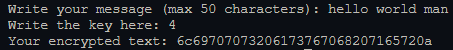

# xyz26
A light, compact and fast encryption method

> This method is being developed and is not ready for use, you can run the test file if you want!

## Compile
```bash
gcc main.c -o main
```

## Usage
```bash
./main
```

## Example


> This is an example only, the method is not ready, and the project is in development.

## Contributing
You can contribute to this project by opening an issue or a pull request freely.